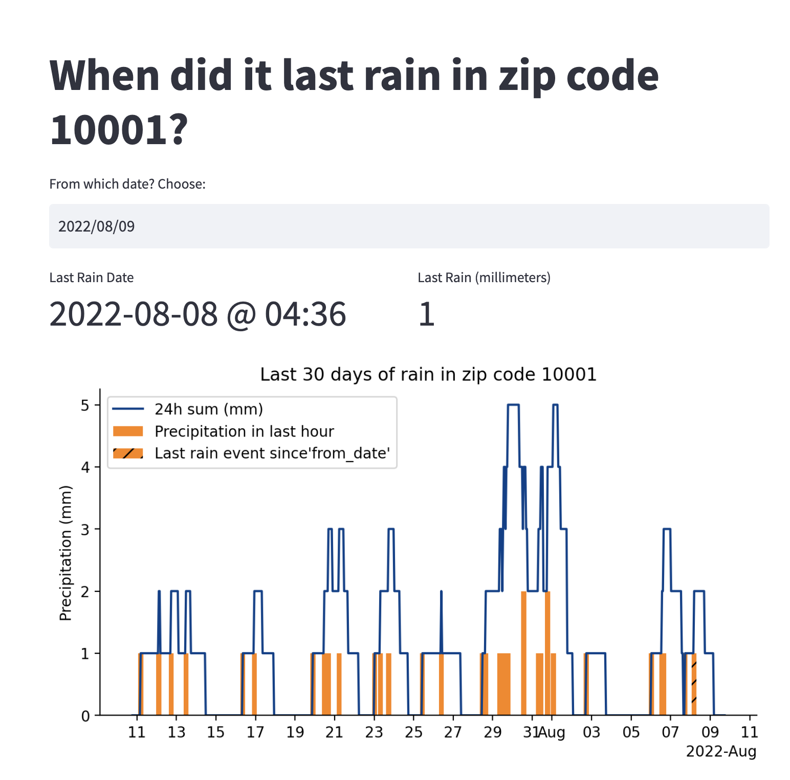

# Hometown Precipitation

This repo records the hourly precipitation for a given zip code and displays the last precipitation event as of a given date. It uses GitHub Actions to run a script every hour that writes precipitation accumulation for the last hour to a database. Precipitation data is obtained via the [OpenWeather API](https://home.openweathermap.org/).

An example of the app is shown below on simulated data:




## How to track precipitation for your hometown

1. Create a (free) account on [OpenWeather](https://openweathermap.org)  
    Remember the [API key](https://openweathermap.org/api_keys), you'll need to paste it later.

2. [Fork](https://github.com/arvkevi/hometown_precipitation/fork) the repo and clone it

    ```shell
    git clone git@github.com:[your_username]/hometown_precipitation.git
    cd hometown_precipitation
    ```

3. Use `create_table.sql` to create a table in an existing PostgreSQL database.

    I used a free teir plan at [Elephantsql](https://www.elephantsql.com/) to create a database.  

    ```shell
    $DATABASE_URL = postgres://{user}:{password}@{hostname}:{port}/{database-name}
    psql $DATABASE_URL < sql/create_table.sql
    ```

4. Create secrets for Github Actions

    From your forked repo's homepage, go to settings, then secrets, then actions.  
    
    Create the following secrets, using the "New repository secret" button: 
    
        a. `API_KEY` 
        b. `ZIP_CODE`
        c. `CONNECTION_URI`

    The `CONNECTION_URI` value is the connection string for your database.
    The `API_KEY` value is the API key for the OpenWeather API.
    The `ZIP_CODE` value is the zip code for your hometown.

5. Host the streamlit app:
`
    I used [streamlit share](https://share.streamlit.io/). 

        a. Click new app  
        b. Enter the name of your `username/repo`  
        c. Change the Main file path to `app.py`  
        d. Click "Advanced Settings"  
            Add:
            `CONNECTION_URI = $DATABASE_URL`
            `ZIP_CODE = YOUR_ZIP_CODE`

Visit the app and keep track of rain events :)

# Recreate the example locally

Run the `create_example.ipynb` notebook to generate example data.

```shell
cd hometown_precipitation
export ZIP_CODE=10001
export CONNECTION_URI=postgres://{user}:{password}@{hostname}:{port}/{database-name}
streamlit run app.py
```

Enter the following into your browser: `localhost:5000`
